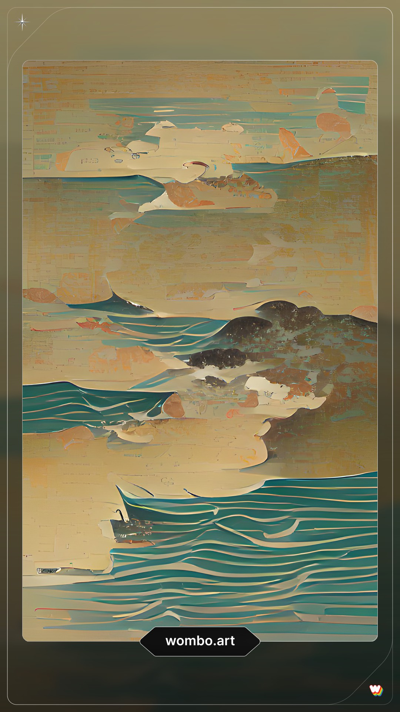
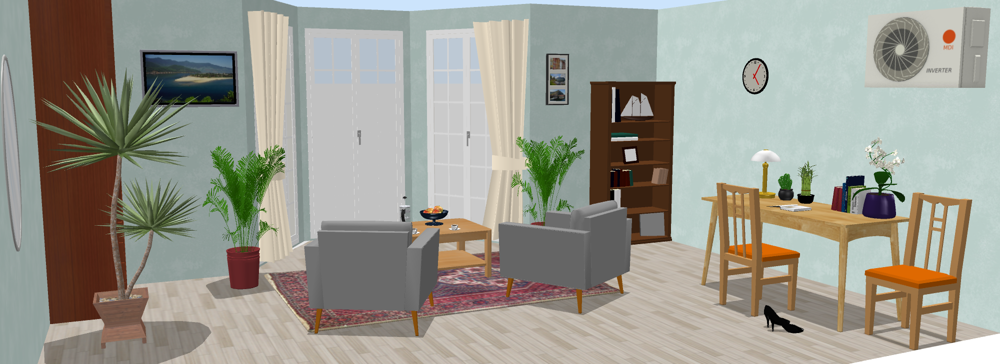

<html>
  <head>
    <h1> Биография Кая </h1>
  </head>
  <body style= "SVGFont 1 обычный"> </body>
  Кай
    
  <body>
    
 Кай - малоизвестный художник и сирота. В 10 лет он попал в детский дом, и единственные воспоминания, которые остались у него о детстве - это небольшой домик с большими окнами на берегу моря. Он хранит и лелеят эти воспоминания, и на своих картинах изображает только морские пейзажи. Кай копит деньги и мечтает перебраться к морю, купив там похожий на воспоминания дом. 

  </body>
  
 Работы Кая 

    
    
    
  
 Воспоминания о доме у моря 

     
  <ul>
    <li> <a href= "https://youtu.be/JEsvIpAVn8Q">Видео о Кае </a> </li>
    
    <ul>
    <li> <a href= "https://disk.yandex.ru/d/jaV53rxsng22Cw">Скачать шрифт </a> </li>
    </html>
